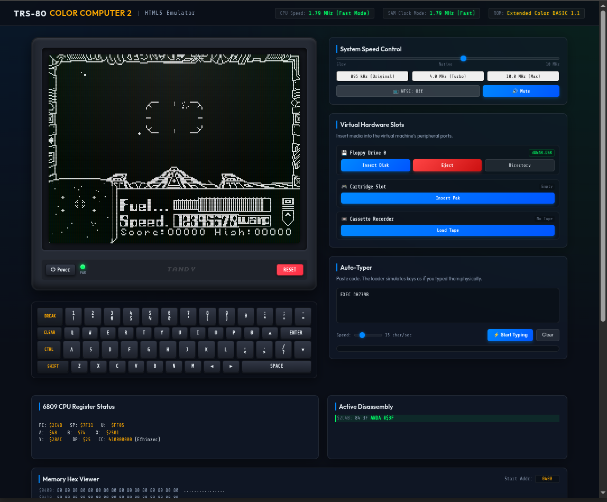

# 🥥 CoCoNut.js: HTML5 Tandy Color Computer 2 Emulator

An interactive, browser-based emulator for the **Tandy Color Computer 2 (CoCo 2)**. Built with HTML5, CSS3, and JavaScript, this project brings the Motorola 6809 microprocessor and the CoCo's unique support chips (SAM, PIA, VDG) to the web with real-time hardware diagnostics, audio conditioning, and gamepad mapping.

Have you ever wanted to play 3D Space Wars and enjoy it?

This was written entirely by Gemini 3.5 Flash (Medium)! While the project definition, feature set, design, and debugging were performed by me and an awful amount of prompting was needed to get it to this state (~5 real hours!), it's still entirely written by Gemini. Enjoy!

---

## 🚀 Capabilities & Features

### 📺 Video & Rendering (MC6847 VDG)
* Emulates the **MC6847 Video Display Generator (VDG)** modes, supporting alphanumeric, semigraphics, and color modes.
* Interactive NTSC artifact coloring configurations (**Monochrome**, **Phase 0**, and **Phase 1**).

### 🛠️ Hardware Diagnostic Panels (Full-Width Row)
* **6809 CPU Register Status:** Displays CPU registers (`PC`, `SP`, `U`, `A`, `B`, `X`, `Y`, `DP`, `CC`) updating in real-time.
* **Active Disassembly:** Displays a live assembly disassembly of the instruction currently being executed by the CPU.
* **Memory Hex Viewer:** An expanded 512-byte display mapped by default to `$0400`–`$05FF` (the text screen video RAM) updating in real-time.

### 💾 Virtual Hardware & Media Slots
* **Floppy Disk (.dsk):** High-level client-side FAT sector parser. Displays disk contents in the browser UI, injects BASIC/binary programs directly into RAM, and features a one-click **Eject** handler.
* **Cartridge Slot (.ccc / .rom):** Supports instant warm boot. Accurately simulates the AC-coupled `CART*` pin capacitor discharge to trigger a transient `/FIRQ` pulse and boot games (like *Dungeons of Daggorath*). Features a one-click **Eject** reset handler.
* **Cassette Tape Slot (.wav):** Emulates the analog cassette motor control relay and digitizes audio files into a 1-bit square wave comparator input to support standard `CLOAD` / `CLOADM` operations.

### ⌨️ Input & Gamepad Integration
* **Keyboard Matrix:** Emulates the $8 \times 7$ keyboard scan matrix. Includes an interactive on-screen virtual keyboard.
* **Auto-Typer:** Dumps text buffers into the matrix. Employs a carriage return delay (~500ms) to give the slow ROM BASIC interpreter time to parse and execute commands. Auto-blurs controls when finished to prevent focus traps.
* **Gamepad API Support:** Full USB Gamepad mapping:
  * **Left Analog Stick** controls the analog X/Y joystick axes (with deadzone adjustments).
  * **X Button** (or A Button) acts as the Fire button.
  * Inverted Y-axis support.

### 🔊 Audio Conditioning & Emulation
* **High-Resolution Sampling:** Slices CPU execution blocks down to at most 20 cycles, sampling the 6-bit DAC register (`$FF20` bits 2-7) in real-time to avoid aliasing and pitch drop.
* **Low-Pass Filter (LPF):** A digital first-order IIR filter matching a 4 kHz cutoff frequency, smoothing the DAC's sharp "staircase" steps to emulate warm analog TV speaker output.
* **High-Pass Filter (HPF):** An AC-coupling filter matching a 70 Hz cutoff frequency, eliminating DC offsets and preventing speaker click pops when turning audio on/off.

---

## 📁 Project Structure

* [package.json](package.json): Project scripts and package configuration.
* [server.js](server.js): A zero-dependency static node web server to host the application.
* [index.html](index.html): The main web interface, featuring a retro CRT curved display bezel, register/disassembly debug panels, and control consoles.
* [index.css](index.css): Custom CSS styles giving a premium glassmorphic dark-theme design, CRT scanline grids, phosphor glow effects, and modeled keyboard caps.
* [coco2.js](coco2.js): The emulation hub managing RAM/ROM address decoding, MC6847 video output (supporting Text, Semigraphics 4, and PMODE 4 high-res graphics), keyboard matrix strobe scans, and the auto-typer.
* [roms_b64.js](roms_b64.js): Hex/base64 representation of the original Color BASIC v1.3 and Extended Color BASIC v1.1 ROMs, acting as an offline fallback.
* [6809.js](6809.js): The Motorola 6809 CPU core emulator. Modified to support active IRQ and NMI vector execution.

---

## ⚖️ Differences from Other Open-Source Emulators

| Feature | CoCoNut.js | Standard JS Emulators |
| :--- | :--- | :--- |
| **Interrupt Handling** | Level-sensitive lines polled on instruction step boundaries; transient `FIRQ` cartridge pulse emulation. | Standard asynchronous queue flags; prone to timing issues or infinite reboot loops on cartridges. |
| **Audio Resolution** | Slices frames into 20-cycle execution increments to sample the DAC in real-time. | Executes full frames (~15k cycles) in one go, sampling only the final register value (causes 60Hz aliasing). |
| **Audio Filters** | Custom digital LPF (4 kHz) and HPF (70 Hz) to model physical speaker conditioning. | Unfiltered digital output; sounds harsh and produces severe DC clicks/pops. |
| **Disk Loading** | High-level client-side FAT parser; lists files and injects BASIC/binary directly to RAM without Disk ROM. | Requires full emulation of the WD1793 controller registers and a separate physical Disk ROM asset. |
| **Gamepad Integration** | Native Gamepad API support with deadzone configurations and inverted Y-axis. | Keyboard-only inputs or rigid mapping configurations. |

---

## 📖 Feature How-To Guide

### 1. Powering On & Loading ROMs
* Click the **Power** button to turn on the emulator. The virtual green screen will illuminate, and the standard Extended Color BASIC banner will display.
* Clicking **Reset** performs a hardware reset, clearing RAM vectors, ejecting any cartridges, and restoring the SAM clock to `895 kHz`.

### 2. Loading Floppy Disks (`.dsk`)
1. In the **Virtual Hardware Media Slots** panel, find the **Floppy Drive 0** slot and click **Insert Disk**.
2. Select a `.dsk` image.
3. The UI will instantly display a list of all files stored on the virtual disk.
4. Click **Load** next to any file in the list. The emulator will automatically parse the file format, inject the bytes into the appropriate memory vectors, and run the load command in RAM.
5. Click **Eject** next to the slot to clear the buffer.

### 3. Inserting Cartridges (`.ccc` / `.rom`)
1. Click **Insert Pak** next to the **Cartridge Slot**.
2. Load a cartridge image (e.g., `Dungeons of Daggorath`).
3. The emulator will instantly load the cartridge into `$C000`–`$FFEF`, reset the CPU, and pulse the `FIRQ` line to autostart the cartridge.
4. To remove the cartridge and reboot back to BASIC, click the red **Eject** button.

### 4. Running Cassettes (`.wav`)
1. Click **Choose File** in the **Cassette** slot and select a `.wav` file.
2. In the emulator screen, type `CLOAD` (for BASIC) or `CLOADM` (for machine language) and press **Enter**.
3. The BASIC ROM will engage the motor relay, and you will see the cassette status indicator show the active tape name as the emulator feeds the digitized 1-bit audio bits into the PIA comparator.

### 5. Using the Auto-Typer
1. Paste or type any BASIC code in the **Auto-Typer** text area.
2. Click **Start Typing**.
3. The emulator will feed the characters into the keyboard scan matrix. You can adjust the typing rate using the speed slider (default is 15 char/sec).
4. *Tip:* The typer automatically pads carriage returns to prevent command drops.

### 6. Emulating Joysticks (Keyboard / Gamepad)
* **Keyboard:**
  * Use the **Arrow Keys** on your physical keyboard to control the joystick.
  * Press the physical **Left Ctrl** key to fire (this is mapped to the Right Joystick Fire button).
* **Gamepad:**
  * Plug in any USB game controller and press a button to activate it in the browser.
  * Use the **Left Analog Stick** to control the joystick coordinates.
  * Press the **X Button** (Xbox/Standard) or **A Button** to fire.
  * The Y-axis is inverted by default for natural aircraft/retro game controls.

### 7. Speed Overclocking (SAM Turbo)
* Drag the **System Speed Control** slider to increase the clock speed up to `10 MHz` for maximum fast-forward capabilities.
* When set to **Native**, the speed is software-controlled. Executing a POKE in BASIC like `POKE 65495, 0` will instantly switch the SAM Clock Mode in the UI to `1.79 MHz (Fast)` and speed up the CPU accordingly.

---

## 🛠️ Implementation Sources & Credits

This emulator's components are designed based on the following technical specifications:
* **Tandy Color Computer 2 Hardware Reference Manual** (Catalog No. 26-3136)
* **Motorola MC6809 Microprocessor Reference Manual** & Opcode Specs
* **MC6883 Synchronous Address Multiplexer (SAM)** Data Sheet
* **MC6821 Peripheral Interface Adapter (PIA)** Specifications
* **MC6847 Video Display Generator (VDG)** Mode Tables
* File format specifications for `.ccc` (cartridge), `.wav` (cassette), and `.dsk` (floppy sector layout) courtesy of the **Color Computer Archive**.

---

## 📜 License
This project is open-source and licensed under the MIT License.
