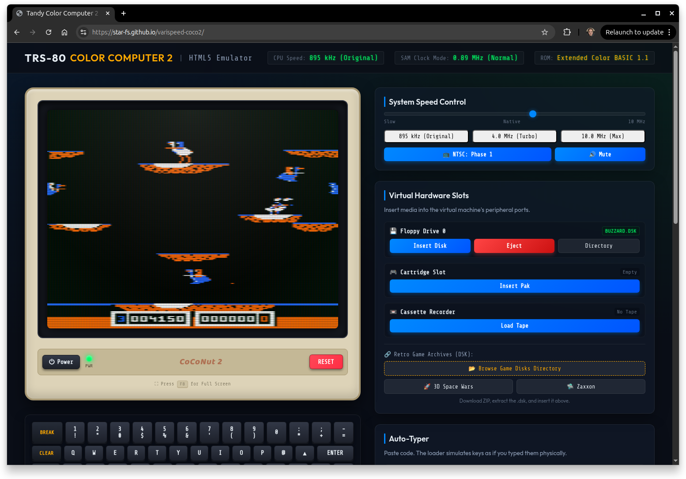

# 🥥 CoCoNut.js: HTML5 Tandy Color Computer 2 Emulator

An interactive, browser-based emulator for the **Tandy Color Computer 2 (CoCo 2)**. Built with HTML5, CSS3, and JavaScript, this project brings the Motorola 6809 microprocessor and the CoCo's unique support chips (SAM, PIA, VDG) to the web with real-time hardware diagnostics, analog video/audio conditioning, and independent keyboard/gamepad joystick ports.

Have you ever wanted to play 3D Space Wars and enjoy it?

This was written entirely by Gemini 3.5 Flash (Medium). Later migrated to Claude code Sonet 5.

While the project definition, feature set, design, and debugging were performed by me and an awful amount of prompting was needed to get it to this state (~5 real hours), it's still entirely written by AI. Enjoy.

Play Online live from this repository: https://star-fs.github.io/varispeed-coco2/  

---

## 🚀 Capabilities & Features

### 📺 Video & Rendering (MC6847 VDG)
* Emulates the **MC6847 Video Display Generator (VDG)**: alphanumeric, Semigraphics 4, and all eight CG/RG graphics submodes (CG1–CG3, CG6, RG1–RG3, RG6/PMODE 4).
* Vertical resolution is derived from the **SAM's own V0-V2 mode bits**, not just the VDG's GM bits — correctly renders games that deliberately pair a fine-grained pixel format with a coarser SAM row count to halve their VRAM footprint.
* Interactive NTSC signal configurations (**Monochrome**, **Phase 0**, and **Phase 1**) — see "Analog Conditioning & Emulation" below.

### 🛠️ Hardware Diagnostic Panels (Full-Width Row)
* **6809 CPU Register Status:** Displays CPU registers (`PC`, `SP`, `U`, `A`, `B`, `X`, `Y`, `DP`, `CC`) updating in real-time.
* **Active Disassembly:** Displays a live assembly disassembly of the instruction currently being executed by the CPU.
* **Memory Hex Viewer:** An expanded 512-byte display mapped by default to `$0400`–`$05FF` (the text screen video RAM) updating in real-time.

### 💾 Virtual Hardware & Media Slots
* **Floppy Disk (.dsk):** High-level client-side FAT sector parser. Displays disk contents in the browser UI, injects BASIC/binary programs directly into RAM, and features a one-click **Eject** handler.
* **Cartridge Slot (.ccc / .rom):** Supports instant warm boot. Accurately simulates the AC-coupled `CART*` pin capacitor discharge to trigger a transient `/FIRQ` pulse and boot games (like *Dungeons of Daggorath*). Features a one-click **Eject** reset handler.
* **Cassette Tape Slot (.wav):** Emulates the analog cassette motor control relay and digitizes audio files into a 1-bit square wave comparator input to support standard `CLOAD` / `CLOADM` operations.

### ⌨️ Input & Gamepad Integration
* **Keyboard Matrix:** Emulates the $8 \times 7$ keyboard scan matrix. Includes an interactive on-screen virtual keyboard.
* **Auto-Typer:** Dumps text buffers into the matrix. Employs a carriage return delay (~500ms) to give the slow ROM BASIC interpreter time to parse and execute commands. Auto-blurs controls when finished to prevent focus traps.
* **Two independent joystick ports**, matching real CoCo port labeling: the **keyboard** (arrow keys + Left Ctrl to fire) always drives the **right** joystick (Player 2 on most 2-player games), and a connected **USB gamepad** (left analog stick, with deadzone; X or A button to fire) always drives the **left** joystick (Player 1). This lets one person play a 2-player game solo with gamepad + keyboard.

### 🎛️ Analog Conditioning & Emulation
Real CoCo hardware doesn't hand a TV clean pixels or clean audio — everything passes through analog stages (composite video encoding, a bandwidth-limited speaker circuit) that color and soften the signal. This emulator models those stages as a separate step *after* the VDG/DAC's digital output, rather than baking approximations into the chip cores themselves.

**Video:**
* **NTSC Artifact Coloring:** In **Phase 0**/**Phase 1** mode, monochrome (RG) graphics rows are re-decoded the way a real NTSC composite decoder would: adjacent black/white dot pairs are reinterpreted as blue/orange chrominance artifacts, then passed through a 3-tap horizontal blur to simulate RF composite bandwidth limiting. The same blur is also applied to 4-color (CG) modes for visual consistency (skipped on CG6, where the already-large stretched pixels just look muddy blurred).
* **True Monochrome Mode:** Selecting **Monochrome** doesn't just disable artifact colors — it desaturates the entire rendered frame (text, semigraphics, CG, and RG alike) to grayscale via standard luma weighting (0.299R + 0.587G + 0.114B), the same way a real black-and-white CoCo monitor discards a composite signal's color subcarrier and decodes only luminance.
* **CRT Screen Treatment:** The canvas itself carries a `contrast`/`brightness` CSS filter for a warmer phosphor look, and a scanline overlay (a layered CSS gradient background sitting on top of the canvas, not part of the emulated pixel data) adds horizontal scanline darkening and a faint RGB chromatic fringe for a CRT feel. Off/background pixels are rendered as a dark phosphor green (`#001100`) rather than pure black, matching a real CRT's black level.

**Audio:**
* **High-Resolution Sampling:** Slices CPU execution blocks down to at most 20 cycles, sampling the 6-bit DAC register (`$FF20` bits 2-7) in real-time to avoid aliasing and pitch drop.
* **Low-Pass Filter (LPF):** A digital first-order IIR filter matching a 4 kHz cutoff frequency, smoothing the DAC's sharp "staircase" steps to emulate warm analog TV speaker output.
* **High-Pass Filter (HPF):** An AC-coupling filter matching a 70 Hz cutoff frequency, eliminating DC offsets and preventing speaker click pops when turning audio on/off.

---

## 📁 Project Structure

* [package.json](package.json): Project scripts and package configuration.
* [server.js](server.js): A zero-dependency static node web server to host the application.
* [index.html](index.html): The main web interface, featuring a retro CRT curved display bezel, register/disassembly debug panels, and control consoles.
* [index.css](index.css): Custom CSS styles giving a premium glassmorphic dark-theme design, CRT scanline grids, phosphor glow effects, and modeled keyboard caps.
* [coco2.js](coco2.js): The emulation hub managing RAM/ROM address decoding, keyboard matrix strobe scans, gamepad/joystick input, audio/cassette sampling, disk/cartridge loading, the auto-typer, and UI wiring. Delegates chip-specific behavior to mc6883.js, mc6821.js, and mc6847.js.
* [mc6883.js](mc6883.js): The MC6883 Synchronous Address Multiplexer (SAM) emulator core — VDG mode/display-offset/CPU-speed/memory-map register decoding.
* [mc6821.js](mc6821.js): The MC6821 Peripheral Interface Adapter (PIA) emulator core. A single reusable chip model instantiated twice in coco2.js (PIA0 for keyboard/joysticks, PIA1 for sound/VDG control/cassette/cartridge FIRQ).
* [mc6847.js](mc6847.js): The MC6847 Video Display Generator (VDG) emulator core — decodes VRAM into raw digital pixels for Text/Semigraphics 4 and all eight CG/RG graphics submodes, using the SAM's V0-V2 bits for vertical resolution. Analog signal conditioning (NTSC artifact coloring, composite blur, monochrome desaturation) is intentionally *not* here; it's supplied by coco2.js via callback hooks, mirroring where the audio LPF/HPF conditioning lives.
* [roms_b64.js](roms_b64.js): Hex/base64 representation of the original Color BASIC v1.3 and Extended Color BASIC v1.1 ROMs, acting as an offline fallback.
* [mc6809.js](mc6809.js): The Motorola MC6809 CPU core emulator. Modified to support active IRQ and NMI vector execution.

---

## ⚖️ Differences from Other Open-Source Emulators

| Feature | CoCoNut.js | Standard JS Emulators |
| :--- | :--- | :--- |
| **Interrupt Handling** | Level-sensitive lines polled on instruction step boundaries; transient `FIRQ` cartridge pulse emulation. | Standard asynchronous queue flags; prone to timing issues or infinite reboot loops on cartridges. |
| **Audio Resolution** | Slices frames into 20-cycle execution increments to sample the DAC in real-time. | Executes full frames (~15k cycles) in one go, sampling only the final register value (causes 60Hz aliasing). |
| **Audio Filters** | Custom digital LPF (4 kHz) and HPF (70 Hz) to model physical speaker conditioning. | Unfiltered digital output; sounds harsh and produces severe DC clicks/pops. |
| **Disk Loading** | High-level client-side FAT parser; lists files and injects BASIC/binary directly to RAM without Disk ROM. | Requires full emulation of the WD1793 controller registers and a separate physical Disk ROM asset. |
| **Graphics Mode Addressing** | Derives vertical resolution from the SAM's own V0-V2 mode bits, not just the VDG's GM bits — correctly renders games that pair a fine pixel format with a coarser SAM row count to save VRAM. | Assumes GM bits alone determine resolution; misrenders (e.g. duplicated/split screens) games relying on this SAM/VDG split. |
| **Gamepad Integration** | Native Gamepad API support with deadzone configurations; gamepad and keyboard drive independent joystick ports (left/right) matching real hardware, so one person can play a 2-player game solo. | Keyboard-only inputs, or a single input source shared/overwritten across both virtual joysticks. |

---

## 📖 Feature How-To Guide

### 1. Powering On & Loading ROMs
* Click the **Power** button to turn on the emulator (it also powers on automatically on page load). The virtual screen will illuminate, and the standard Extended Color BASIC banner will display. Audio starts **unmuted** and the NTSC mode starts on **Phase 1** by default — use the toggle buttons in System Speed Control to change either.
* Clicking **Reset** performs a CPU/PIA/SAM register reset and restarts execution at the ROM's reset vector, restoring the SAM clock to `895 kHz`. It does **not** clear RAM. If a cartridge is inserted, Reset re-seats it and re-arms its autostart pulse (exactly like pressing Reset on real hardware with a Pak plugged in) rather than ejecting it — use the **Eject** button to actually remove a cartridge.
* Press **F8** to toggle full-screen mode (letterboxed to the CoCo's 4:3 aspect ratio).

### 2. Loading Floppy Disks (`.dsk`)
1. In the **Virtual Hardware Slots** panel, find the **Floppy Drive 0** slot and click **Insert Disk**.
2. Select a `.dsk` image.
3. A directory listing of the disk pops up automatically.
4. Click directly on any file's row in the list to load it. The emulator parses the file format, injects the bytes into the appropriate memory vectors, and runs/loads it in RAM.
5. Click **Directory** to reopen that listing later without re-selecting the file, or **Eject** to clear the drive.
6. Prefer a real game over typing one in? The **Retro Game Archives** panel links straight to the Color Computer Archive's disk collection — download a `.zip`, extract the `.dsk`, and insert it above.

### 3. Inserting Cartridges (`.ccc` / `.rom`)
1. Click **Insert Pak** next to the **Cartridge Slot**.
2. Load a cartridge image (e.g., `Dungeons of Daggorath`).
3. The emulator will instantly load the cartridge into `$C000`–`$FFEF`, reset the CPU, and pulse the `FIRQ` line to autostart the cartridge.
4. To remove the cartridge and reboot back to BASIC, click the red **Eject** button.

### 4. Running Cassettes (`.wav`)
1. Click **Load Tape** in the **Cassette Recorder** slot and select a `.wav` file.
2. In the emulator screen, type `CLOAD` (for BASIC) or `CLOADM` (for machine language) and press **Enter**.
3. The BASIC ROM will engage the motor relay, and you will see the cassette status indicator show the active tape name as the emulator feeds the digitized 1-bit audio bits into the PIA comparator.

### 5. Using the Auto-Typer
1. Paste or type any BASIC code in the **Auto-Typer** text area.
2. Click **Start Typing**.
3. The emulator will feed the characters into the keyboard scan matrix. You can adjust the typing rate using the speed slider (default is 15 char/sec).
4. *Tip:* The typer automatically pads carriage returns to prevent command drops.

### 6. Emulating Joysticks (Keyboard / Gamepad)
The keyboard and a USB gamepad drive **independent** joystick ports, matching real CoCo hardware's port labeling — so one person can play a 2-player game solo, one controller each.

* **Keyboard → Right Joystick (Player 2 on most 2-player games):**
  * Use the **Arrow Keys** to control the joystick axes.
  * Press the physical **Left Ctrl** key to fire.
* **Gamepad → Left Joystick (Player 1 on most 2-player games):**
  * Plug in any USB game controller and press a button to activate it in the browser.
  * Use the **Left Analog Stick** to control the joystick axes (with deadzone adjustment).
  * Press the **X Button** (Xbox/Standard) or **A Button** to fire.
  * Which port a given game expects for a single player varies by title — if the keyboard doesn't seem to do anything, try the gamepad (and vice versa).

### 7. Speed Overclocking (SAM Turbo)
* Drag the **System Speed Control** slider to increase the clock speed up to `10 MHz` for maximum fast-forward capabilities.
* When set to **Native**, the speed is software-controlled. Executing a POKE in BASIC like `POKE 65495, 0` will instantly switch the SAM Clock Mode in the UI to `1.79 MHz (Fast)` and speed up the CPU accordingly.

---

## 🛠️ Implementation Sources & Credits

This emulator's components are designed based on the following technical specifications:
* **Tandy Color Computer 2 Hardware Reference Manual** (Catalog No. 26-3136)
* **Motorola MC6809 Microprocessor Reference Manual** & Opcode Specs
* **MC6883 Synchronous Address Multiplexer (SAM)** Data Sheet
* **MC6821 Peripheral Interface Adapter (PIA)** Specifications
* **MC6847 Video Display Generator (VDG)** Mode Tables
* File format specifications for `.ccc` (cartridge), `.wav` (cassette), and `.dsk` (floppy sector layout) courtesy of the **Color Computer Archive**.

---

## 📜 License
This project is open-source and licensed under the MIT License.
